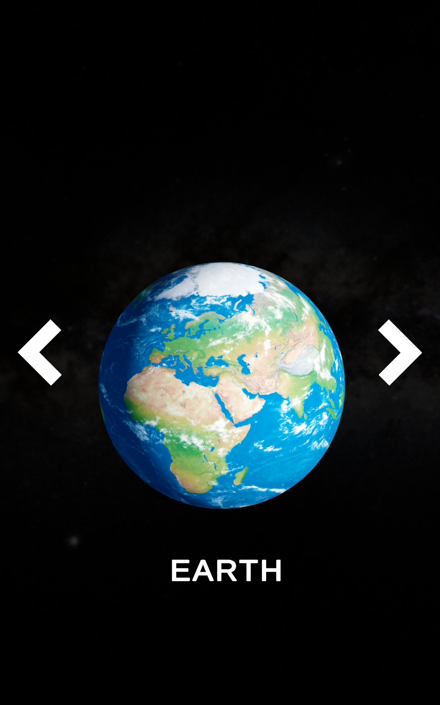
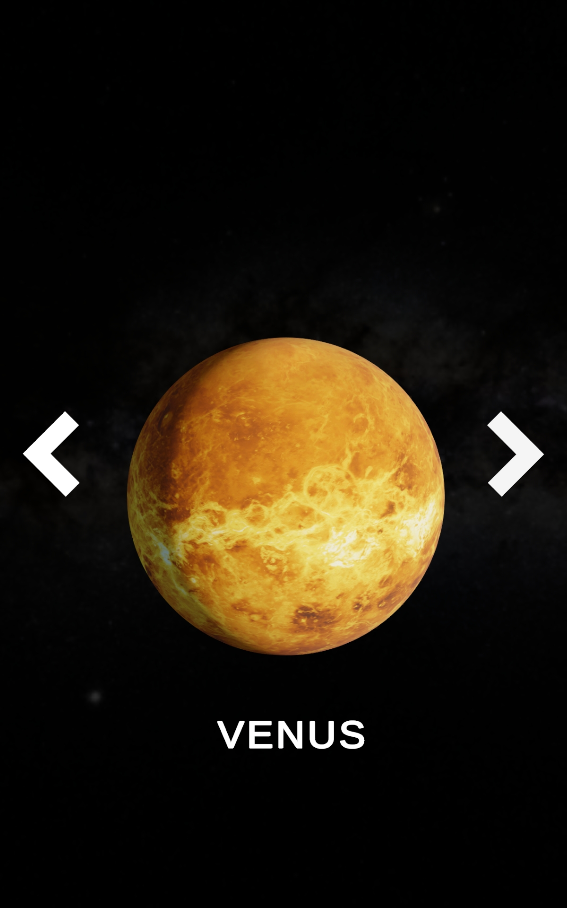
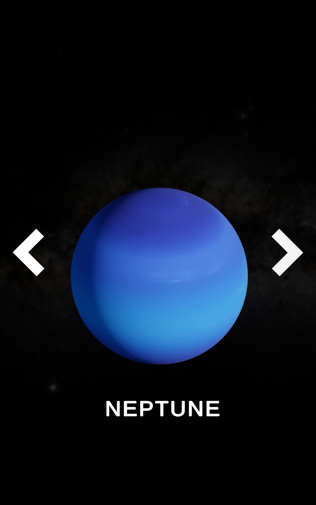
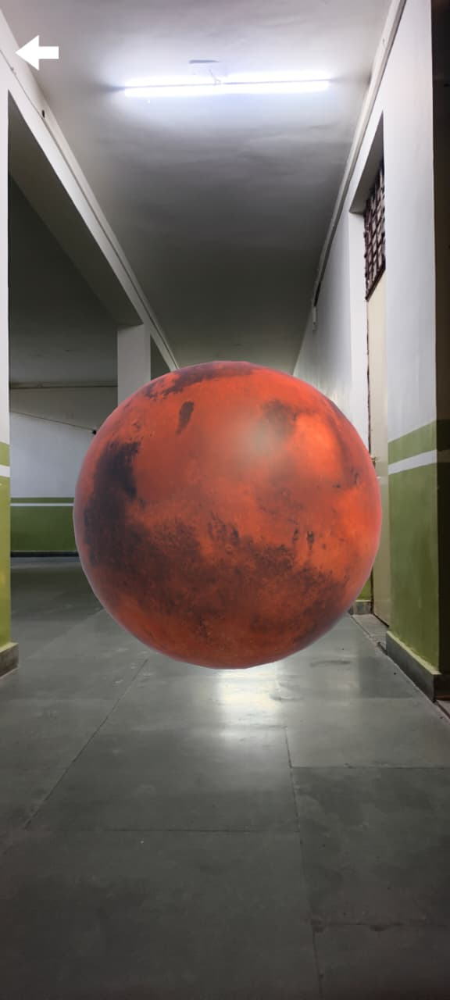
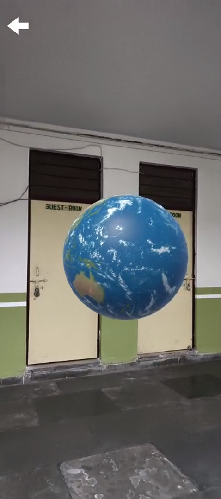
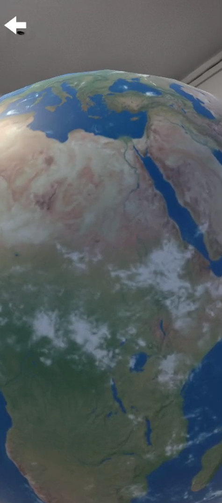
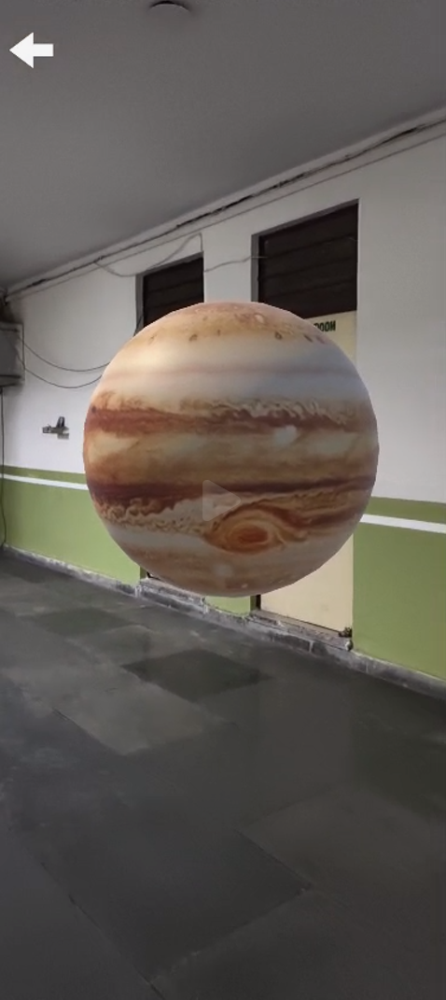
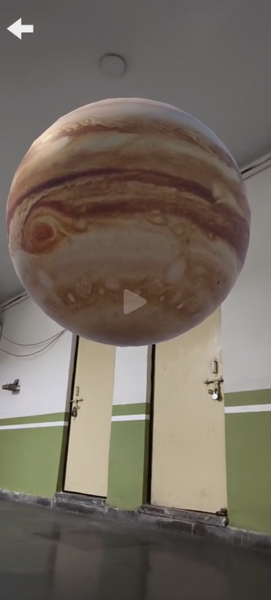
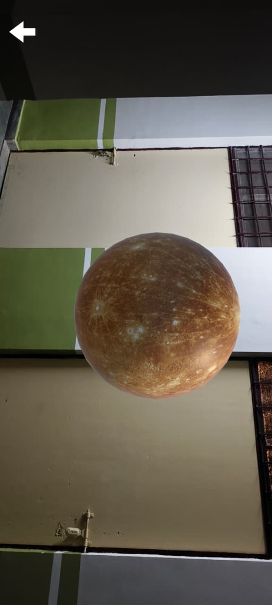

# AR Planet Simulation (Unity)

<p align="center">
  
  
</p>

An interactive **Augmented Reality (AR) Solar System experience** built with Unity. This project enables users to explore planets in an immersive way by selecting them through a UI and placing them into their real-world environment using AR.

---

## Full Demo

## Full Demo

<table align="center">
<tr>
<td align="center">
<video src="https://github.com/user-attachments/assets/1fb81642-e709-4bc9-a0b5-041c56922ea5" controls width="250"></video>
</td>
<td align="center">
<video src="https://github.com/user-attachments/assets/ccb70e76-0c78-410e-af0e-a5345c65e5a0" controls width="250"></video>
</td>
</tr>
</table>

---

## Overview

AR Planet Simulation is a mobile-based AR application built using Unity and AR Foundation. It combines UI systems with real-world spatial tracking to allow users to visualize planets around them.

---

## Features

### Planet Selection System

- Carousel-based UI for browsing planets
- Smooth transitions between planets
- Dynamic switching of 3D models

### Augmented Reality Placement

- Real-time plane detection
- Tap-to-place functionality
- Stable anchoring

### Interactive Visualization

- Rotatable planet models
- Realistic textures
- Seamless interaction

---

## Tech Stack

- Unity (2021+)
- C#
- AR Foundation (ARCore / ARKit)
- TextMesh Pro

---

## Project Structure

```bash
Assets/
│── Import/
│── Materials/
│── Scenes/
│── Scripts/
│── TextMesh Pro/
│── XR/
```

---

## Screenshots

<p align="center">
  
  
  
</p>

<p align="center">
  
  
  
</p>

<p align="center">
  
  
  
</p>

---

## How It Works

1. Select a planet from UI
2. Scan environment for surfaces
3. Tap to place planet
4. Explore in AR

---

## Setup

```bash
git clone https://github.com/adhishcantcode/AR-Planet-Simulation.git
```

- Open in Unity
- Install AR Foundation
- Build on mobile device

---

## Future Improvements

- Add more planets
- Add planet info
- Orbit simulation
- Multiplayer AR

---

## Author

Adhish Gupta
Unity Developer | AR/VR Enthusiast

---
